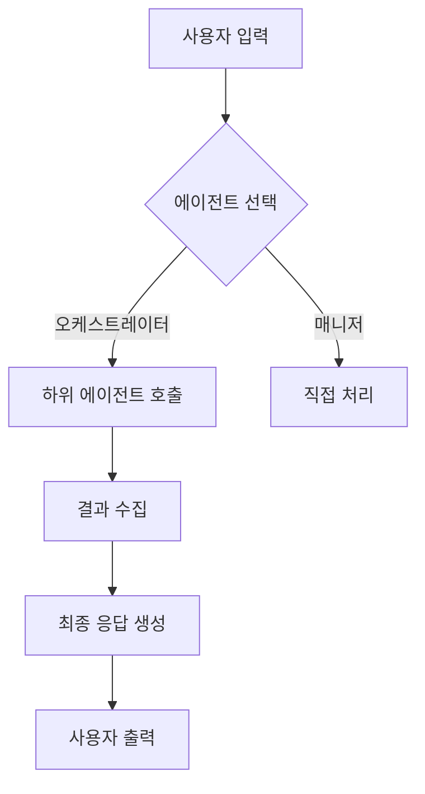
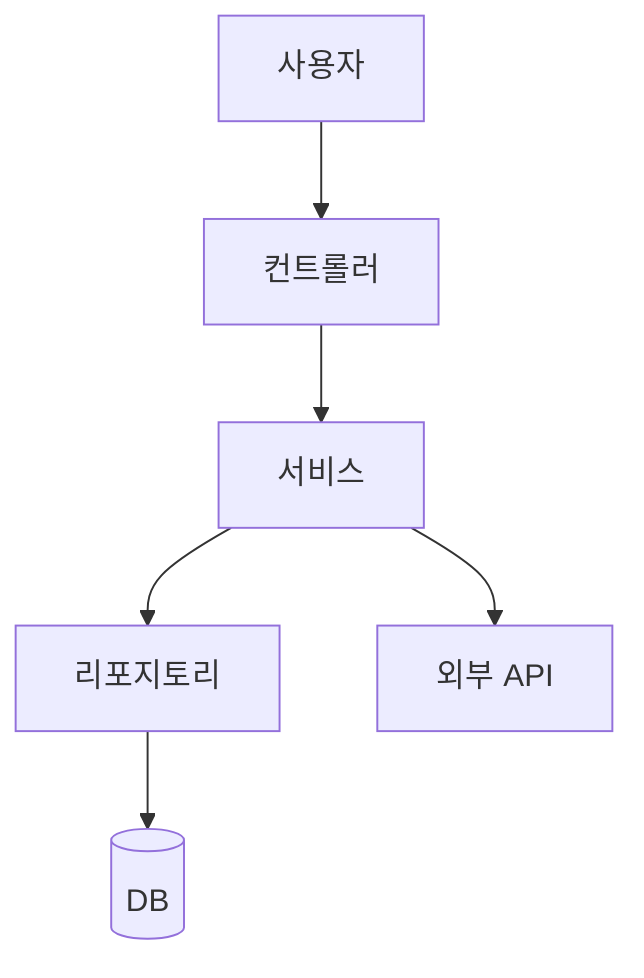
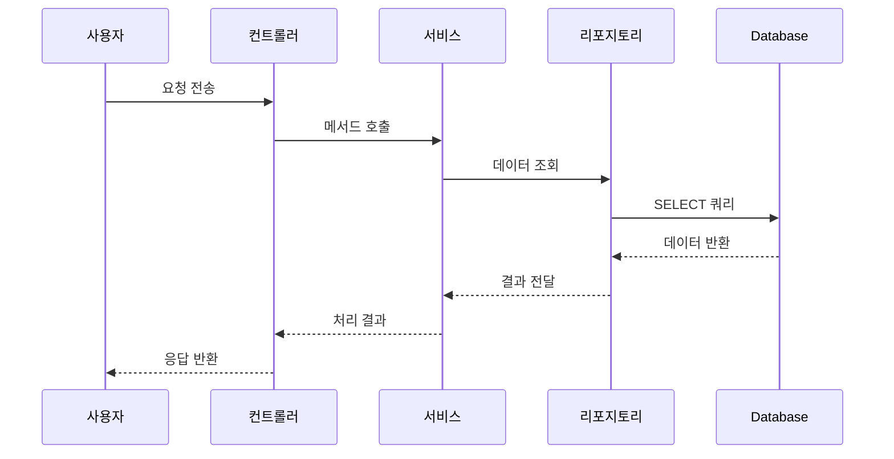

# 개발자 문서 작성 가이드라인 (범용)

> 대상: 신규/주니어 개발자
>
> 목적: "어떤 기능이 언제, 왜, 어디서, 어떻게 동작하는지"를 기능 단위로 빠르게 이해할 수 있도록 정리
> - 누가, 언제, 어디서, 무엇을, 어떻게, 했나 6하 원칙 적용
> - 이 가이드는 모든 프로젝트(`cmh-*`, `aideworks` 등)에 동일하게 적용됩니다.

---

## 목차

1. [문서 파일 구조](#1-문서-파일-구조-directory-structure)
2. [문서 파일 형식](#2-문서-파일-형식-frontmatter)
3. [Markdown 제목 계층](#3-markdown-제목-계층-heading-hierarchy)
4. [기본 문서 구조](#4-기본-문서-구조-template)
5. [링크 참조 방식](#5-링크-참조-방식)
6. [코드 블록 작성 규칙](#6-코드-블록-작성-규칙)
7. [강조 및 포맷팅](#7-강조-및-포맷팅)
8. [정보/경고 박스](#8-정보경고-박스-callouts)
9. [목록 작성 규칙](#9-목록-작성-규칙)
10. [테이블 작성 규칙](#10-테이블-작성-규칙)
11. [파일/디렉토리 트리 표기](#11-파일디렉토리-트리-표기)
12. [인용문](#12-인용문-blockquote)
13. [수평선](#13-수평선-horizontal-rule)
14. [문서 스타일 가이드](#14-문서-스타일-가이드)
15. [Markdown 린트 규칙](#15-markdown-린트-규칙)
16. [문서 작성 체크리스트](#16-문서-작성-체크리스트)
17. [다이어그램 작성 가이드](#17-다이어그램-작성-가이드)
18. [문서 예시](#18-문서-예시-complete-example)
19. [참고: 문서 빌드 및 배포](#19-참고-문서-빌드-및-배포)
20. [추가 리소스](#20-추가-리소스)

---

## 1. 문서 파일 구조 (Directory Structure)

```text
프로젝트 루트/
├── docs/                          # 프로젝트 문서 (주요)
│   ├── index.md                   # 메인 목차
│   ├── README.md                  # 프로젝트 개요
│   ├── markdown-style-config.yml  # Markdown 린트 규칙
│   ├── guides/                    # 주요 가이드 카테고리
│   │   ├── installation/          # 설치 가이드
│   │   ├── getting-started/       # 시작하기
│   │   ├── architecture/          # 아키텍처
│   │   ├── features/              # 기능 상세
│   │   │   ├── feature-a/         # 각 기능별 폴더
│   │   │   │   ├── index.md       # 기능 개요
│   │   │   │   ├── architecture.md
│   │   │   │   ├── structure.md
│   │   │   │   ├── algorithm.md
│   │   │   │   ├── logic.md
│   │   │   │   ├── process.md     # 프로세스 다이어그램 포함
│   │   │   │   └── entities.md    # 관련 엔티티/테이블
│   │   │   └── feature-b/
│   │   ├── api/                   # API 문서
│   │   ├── deployment/            # 배포 가이드
│   │   └── troubleshooting/       # 문제 해결
│   ├── concepts/                  # 개념 설명
│   ├── references/                # 참조 문서
│   └── resources/                 # 리소스
│       ├── guidelines/            # 개발 가이드라인 (핵심)
│       │   ├── documentation/     # 문서 작성 가이드 (이 파일)
│       │   ├── code/              # 코딩 가이드
│       │   ├── testing/           # 테스트 가이드
│       │   └── architecture/      # 아키텍처 원칙
│       └── templates/             # 문서 템플릿
├── .docs/                         # 내부 개발 문서 (Git 관리)
│   ├── agents/                    # AI 에이전트 문서
│   ├── patterns/                  # 개발 패턴
│   └── decisions/                 # 기술 결정 기록 (ADR)
├── src/                           # 소스 코드
│   ├── main/                      # 메인 소스
│   ├── renderer/                  # 렌더더 (AideWorks 스타일)
│   └── plugin/                    # 플러그인 (Shopware 스타일)
└── tests/                         # 테스트
```

**핵심 원칙:**
- `docs/` - 사용자/개발자 대상 외부 문서 (빌드/배포 가능)
- `.docs/` - 내부 개발 과정 문서 (Git 관리, 빌드 불필요)
- 기능별 폴더 구조로 관련 문서를 한 곳에 모음
- 각 기능 폴더에는 `index.md` (개요) + 세부 문서 조합

---

## 2. 문서 파일 형식 (Frontmatter)

모든 Markdown 문서는 **YAML Frontmatter**로 시작해야 합니다.

```yaml
---
nav:
  title: 문서 제목 (네비게이션에 표시될 이름)
  position: 숫자 (네비게이션 순서, 낮을수록 위)
---
```

**예시:**
```yaml
---
nav:
  title: Agent architecture overview
  position: 10
---
```

**필수 필드:**
- `nav.title`: 문서 제목 (대문자 시작, 문장형)
- `nav.position`: 정수, 순서 결정 (1부터 시작)

**선택 필드:**
- `hidden: true` - 네비게이션에서 숨김
- `category: "기술"` - 문서 카테고리 태그

---

## 3. Markdown 제목 계층 (Heading Hierarchy)

```markdown
# H1 - 문서 제목 (Frontmatter 다음에 한 번만)
## H2 - 주요 섹션
### H3 - 하위 섹션
#### H4 - 더 세부 섹션 (필요시)
```

**규칙:**
- H1은 문서당 **한 번만** 사용 (Frontmatter 다음)
- 제목은 **문장형**으로 작성 (첫 글자 대문자)
- 제목 뒤에 **구두점 없음**
- 계층은 **한 단계씩** 증가 (MD001 규칙)
- H4 이상은 가급적 사용하지 않음 (필요시 문서 분할 고려)

---

## 4. 기본 문서 구조 (Template)

```markdown
---
nav:
  title: 가이드 제목
  position: 10
---

# 가이드 제목

## Overview (개요)

- 이 가이드가 다루는 내용을 2-3 문장으로 요약
- 어떤 독자를 대상으로 하는지 명시
- 관련 가이드 링크 제공

## Prerequisites (사전 요구사항)

- 필요한 조건 나열 (프로젝트 설치, 런타임 버전 등)
- 이전에 읽어야 할 가이드가 있으면 링크 제공

## 본문 섹션 1

### 하위 섹션 (필요시)

내용...

## 본문 섹션 2

내용...

## Related (관련 문서)

- [다른 가이드 이름](../상대경로/파일명.md)
- [관련 API 문서](../../api/...)
```

**패턴:**
1. **Overview** - 독자가 무엇을 배울지 알려줌
2. **Prerequisites** - 사전 지식/설치 조건 명시
3. **본문** - 단계별 설명, 코드 예제 포함
4. **Related** - 관련 문서 링크

---

## 5. 링크 참조 방식

### 5.1 일반 Markdown 링크
```markdown
[링크 텍스트](../상대경로/파일명.md)
[외부 링크](https://example.com)
```

**상대경로 규칙:**
- `../` - 상위 디렉토리로 이동
- 같은 폴더 내 파일: `파일명.md`
- 하위 폴더: `하위폴더/파일명.md`
- **절대경로(`/`) 금지** - 문서 이동 시 링크 깨짐

### 5.2 프로젝트 내부 참조
```markdown
[기능 개요](./index.md)
[아키텍처 설명](./architecture.md)
```

**위치:**
- 같은 폴더: `./파일명.md`
- 상위 폴더: `../폴더/파일명.md`
- 하위 폴더: `하위폴더/파일명.md`

---

## 6. 코드 블록 작성 규칙

### 6.1 언어 지정 (필수)
```typescript
// <project root>/src/services/agent-manager.ts
export class AgentManager {
  private agents: Map<string, Agent> = new Map();

  async register(agent: Agent): Promise<void> {
    this.agents.set(agent.id, agent);
  }
}
```

```bash
# 프로젝트 루트에서 실행
npm install
npm run dev
```

```json
{
  "name": "cmh-chatbot",
  "version": "0.1.0"
}
```

**지원 언어:** `typescript`, `javascript`, `php`, `python`, `bash`, `json`, `yaml`, `xml`, `html`, `css`, `scss`, `sql`, `markdown`, `dockerfile`

### 6.2 파일 경로 표기
```markdown
// <project root>/src/services/agent-manager.ts
// <project root>/docs/guides/features/chat/index.md
```

**패턴:**
- `<project root>/` - 프로젝트 루트 디렉토리
- `<project root>/src/` - 소스 코드
- `<project root>/docs/` - 문서
- 절대 경로(`C:\` 또는 `/home/`) 금지

### 6.3 코드 블록 옵션
````markdown
```typescript filename="src/example.ts" {1,4-6} highlight
export const example = () => {
  // 이 줄이 강조됨
  const value = 42;
  return value;
};
```
````

**주요 옵션:**
- `filename="..."` - 파일명 표시
- `highlight` - 특정 줄 강조
- `{line-numbers}` - 줄번호 표시

---

## 7. 강조 및 포맷팅

### 7.1 인라인 강조
```markdown
**볼드 텍스트** - 중요한 용어, 클래스명, 메서드명, UI 라벨
`인라인 코드` - 변수, 속성, 파일명, 디렉토리, 명령어
```

**예시:**
- `AgentManager` 클래스
- `register()` 메서드
- `src/config/` 디렉토리
- `npm run build` 명령어
- **주의:** 설정 값은 반드시 저장

### 7.2 코드 내 placeholder
```markdown
$`변수명` - CLI 명령어에서의 placeholder
{parameter} - 함수/메서드 파라미터
<타입> - 제네릭 타입
```

**예시:**
```bash
npm run <command>
# 예: npm run dev
```

---

## 8. 정보/경고 박스 (Callouts)

### 8.1 정보 박스 (info)
```markdown
::: info
중요한 정보, 추가 설명, 참고사항, 팁
:::
```

**렌더링:** 파란색 정보 아이콘 박스

### 8.2 경고 박스 (warning)
```markdown
::: warning
주의사항, 주의해야 할 점, 일반적인 실수
:::
```

**렌더링:** 노란색 경고 아이콘 박스

### 8.3 위험 박스 (danger)
```markdown
::: danger
절대 하면 안 되는 것, 데이터 손실 가능성, 보안 취약점
:::
```

**렌더링:** 빨간색 위험 아이콘 박스

**사용 시점:**
- `info` - 부가 정보, 대안 설명
- `warning` - 잘못하면 문제가 될 수 있는 경우
- `danger` - 데이터 손실/보안/서비스 중단 가능성

---

## 9. 목록 작성 규칙

### 9.1 비순서 목록 (Unordered List)
```markdown
- 항목 1
- 항목 2
  - 하위 항목 2.1 (들여쓰기 2칸)
  - 하위 항목 2.2
- 항목 3
```

**규칙:**
- `-` 대시 사용 (또는 `*`)
- 하위 항목은 **2칸** 들여쓰기
- 같은 레벨은 동일한 기호 사용 (MD004)
- 항목 간 빈 줄 권장 (가독성)

### 9.2 순서 목록 (Ordered List)
```markdown
1. 첫 번째 단계
2. 두 번째 단계
3. 세 번째 단계
```

**규칙:**
- 숫자 뒤에 **`.`** (점)과 공백
- `.` 스타일만 사용 (MD029)
- 실제 숫자보다 1.부터 시작 권장 (자동 정렬)

---

## 10. 테이블 작성 규칙

```markdown
| 열 제목 1 | 열 제목 2 | 열 제목 3 |
|:----------|:---------:|----------:|
| 왼쪽 정렬 | 가운데 정렬 | 오른쪽 정렬 |
| 내용 1    | 내용 2    | 내용 3    |
```

**정렬:**
- `:---` - 왼쪽 정렬
- `:---:` - 가운데 정렬
- `---:` - 오른쪽 정렬

**규칙:**
- 각 열에 `|` 구분자
- 두 번째 줄은 반드시 정렬 표시
- 셀 내용이 길면 줄바꿈 가능
- 열 제목은 **캐멀케이스** 또는 **한국어** 사용

---

## 11. 파일/디렉토리 트리 표기

```text
src/
├── agents/
│   ├── chat-agent/
│   │   ├── index.ts
│   │   ├── agent.service.ts
│   │   └── agent.types.ts
│   └── evaluation-agent/
│       ├── index.ts
│       └── evaluator.service.ts
├── config/
│   ├── default.yaml
│   └── production.yaml
└── utils/
    └── helpers.ts
```

**규칙:**
- `├` - 중간 항목
- `└` - 마지막 항목
- `│` - 수직선
- 들여쓰기 4칸 (또는 2칸)
- 파일명은 `파일.확장자`, 폴더명은 `/`로 구분

---

## 12. 인용문 (Blockquote)

```markdown
> 인용문 내용
> 여러 줄 인용문
> 두 번째 줄
```

**용도:**
- 주의사항 강조
- 외부 내용 인용
- 전제 조건 설명
- 참고 자료 표시

---

## 13. 수평선 (Horizontal Rule)

```markdown
---
```

**용도:**
- 주요 섹션 구분
- 문서 중간에 주제 전환
- 관련 없는 내용 분리

**규칙:**
- `---` (3개 하이픈)
- 주변에 빈 줄
- `***` (별 3개)도 가능하지만 `---` 권장

---

## 14. 문서 스타일 가이드

### 14.1 언어
- 기본 언어: **한국어**
- 국제화 필요 시 영어 병기
- 독일어/중국어/일본어는 필요시 추가

### 14.2 문장 구조
- 간결하고 명확한 문장
- 능동태 사용 ("You can..." → "사용자는...")
- "독자" 중심 서술 (2인칭)
- 기술적 정확성 우선

### 14.3 용어
- 프로젝트 내 공식 용어 사용
- 첫 등장 시 간단한 설명 추가
- 클래스/메서드명은 정확한 이름 사용 (`AgentManager`, `register()`)
- 약어 사용 시 첫 등장에서 풀어쓰기 (예: RAG (Retrieval-Augmented Generation))

### 14.4 시제
- 설명은 **현재형** 사용
- 예제 코드는 현재형
- 절차는 명령형 (Do this, Run that)
- 과거형은 완료된 작업에만 사용

### 14.5 숫자 표현
- 0~9: 숫자 (예: `3개`, `5단계`)
- 10 이상: 아라비아 숫자
- 단위: `KB`, `MB`, `GB` (공백 없음)
- 버전: `v2.1.0` 또는 `2.1.0`

---

## 15. Markdown 린트 규칙

기본 적용 규칙 (주요 항목):

| 규칙 | 설명 | 상태 |
|------|------|------|
| MD001 | 제목 계층은 한 단계씩만 증가 | ✅ |
| MD003 | 제목 스타일 일관성 (atx style `#`) | ✅ |
| MD004 | 불순서 목록 스타일 일관성 (`-`) | ✅ |
| MD005 | 같은 레벨 목록 들여쓰기 일관성 | ✅ |
| MD009 | trailing spaces 금지 | ✅ |
| MD018 | atx 제목에 공백 필수 (`# 제목`) | ✅ |
| MD019 | atx 제목에 공백过多 금지 | ✅ |
| MD022 | 제목 주변 빈 줄 필수 | ✅ |
| MD024 | 같은 내용의 제목 중복 금지 | ✅ |
| MD026 | 제목 끝에 구두점 금지 | ✅ |
| MD030 | 목록 마커 뒤 공백 1칸 | ✅ |
| MD031 | fenced code block 주변 빈 줄 | ✅ |
| MD032 | 목록 주변 빈 줄 | ✅ |
| MD034 | URL에 `<>` 감싸지 않은 bare URL 금지 | ✅ |

**적용:** `markdownlint` 도구로 자동 검사
**자동 수정:** `npm run lint:md:fix` (가능한 항목)

---

## 16. 문서 작성 체크리스트

### 16.1 작성 전
- [ ] 대상 독자 명확화 (초보자/경력자)
- [ ] 이전에 읽어야 할 문서 확인 및 링크
- [ ] 문서 목적 정의 (How-to, Concept, Reference, Tutorial)
- [ ] 적절한 폴더 위치 결정 (기능별 카테고리)

### 16.2 작성 중
- [ ] Frontmatter 작성 (`nav.title`, `nav.position`)
- [ ] H1 제목 (Frontmatter 다음)
- [ ] Overview 섹션 (2-3 문장 요약)
- [ ] Prerequisites 섹션 (필요 조건)
- [ ] 코드 블록에 언어 지정
- [ ] 파일 경로는 `<project root>/` 패턴
- [ ] 클래스/메서드명은 `볼드` 또는 `코드`로
- [ ] 정보/경고 박스 적절히 사용
- [ ] 내부 링크는 상대경로
- [ ] 테이블 정렬 일관성
- [ ] 목록 들여쓰기 규칙 준수

### 16.3 작성 후
- [ ] Markdown 린트 검사 (`npm run lint:md`)
- [ ] 링크 유효성 검사 (broken link 없음)
- [ ] 철자/문법 검사
- [ ] 코드 예제 실행 가능 여부 확인
- [ ] 관련 문서 업데이트 (목차, 참조)
- [ ] 동료 리뷰 (가능한 경우)

---

## 17. 다이어그램 작성 가이드

### 17.1 Mermaid 사용 (권장)



**지원 다이어그램:**
- `flowchart` - 프로세스/순서도
- `sequenceDiagram` - 상호작용 시퀀스
- `classDiagram` - 클래스 관계
- `stateDiagram` - 상태 전이
- `erDiagram` - 데이터베이스 ERD
- `gantt` - 일정/타임라인

### 17.2 다이어그램 작성 원칙
1. **간결한 레이블** - 짧고 명확한 텍스트
2. **일관된 방향** - 왼쪽→오른쪽 또는 위→아래
3. **색상 구분** - 의미 있는 색상 사용 (예: 빨강=에러, 초록=성공)
4. **노드 개수 제한** - 한 다이어그램에 10개 이하 노드 권장
5. **설명 추가** - 다이어그램 아래简要 설명

---

## 18. 문서 예시 (Complete Example)

```markdown
---
nav:
  title: Creating a custom agent
  position: 20
---

# Creating a custom agent

## Overview

This guide explains how to create a custom AI agent in the cmh-chatbot project. Agents process user messages and generate responses using LLM providers. You'll learn the complete workflow from definition to registration.

## Prerequisites

- Completed [Project setup](./setup.md)
- Understanding of TypeScript classes and interfaces
- An LLM provider configured (see [Providers guide](./providers.md))

## Agent structure

Every agent must implement the `AgentInterface`:

```typescript
// <project root>/src/agents/base-agent.ts
export interface AgentInterface {
  readonly id: string;
  readonly name: string;
  readonly description: string;

  process(input: AgentInput): Promise<AgentOutput>;
  validate(input: unknown): boolean;
}
```

::: info
The `validate()` method is called before `process()` to filter unsupported inputs.
:::

## Implement your agent

Create a new file in `src/agents/`:

```typescript
// <project root>/src/agents/my-agent.ts
import { AgentInterface, AgentInput, AgentOutput } from './base-agent';

export class MyAgent implements AgentInterface {
  readonly id = 'my-agent-001';
  readonly name = 'My Custom Agent';
  readonly description = 'A simple example agent';

  async process(input: AgentInput): Promise<AgentOutput> {
    // Your logic here
    return {
      response: `Processed: ${input.message}`,
      metadata: { processedAt: new Date().toISOString() }
    };
  }

  validate(input: unknown): boolean {
    return typeof input === 'object' && input !== null;
  }
}
```

## Register the agent

Add your agent to the agent registry in `src/agent-registry.ts`:

```typescript
import { MyAgent } from './agents/my-agent';

export const agentRegistry = [
  // ... existing agents
  new MyAgent(),
];
```

## Test your agent

Run the development server and test your agent:

```bash
npm run dev
# Visit http://localhost:3000 and select "My Custom Agent"
```

You should see your agent responding to messages.

## Related

- [Agent architecture](./architecture.md)
- [LLM providers](./providers.md)
- [Testing agents](./testing.md)
```

---

## 19. 참고: 문서 빌드 및 배포

### 19.1 로컬에서 문서 빌드
```bash
cd docs
npm install
npm run build
```

### 19.2 문서 미리보기
```bash
npm run start
# http://localhost:3000
```

### 19.3 린트 검사
```bash
npm run lint
# 또는 자동 수정
npm run lint:fix
```

---

## 20. 추가 리소스

- **문서 작성 가이드:** `docs/resources/guidelines/documentation/`
- **코딩 가이드:** `docs/resources/guidelines/code/`
- **아키텍처 원칙:** `docs/resources/guidelines/architecture/`
- **테스트 가이드:** `docs/resources/guidelines/testing/`
- **Markdown 스타일:** `markdown-style-config.yml`
- **기술 결정 기록 (ADR):** `.docs/decisions/`

---

## 21. Breaking Change 마이그레이션 가이드

### 21.1 마이그레이션 원칙
1. **하위 호환성 우선**: 기존 코드가 즉시 깨지지 않도록 점진적 마이그레이션
2. **Deprecation 경고**: 제거될 함수/클래스에 `@deprecated` 주석 및 대체안 명시
3. **마이그레이션 가이드 문서화**: `MIGRATION.md` 또는 `UPGRADE.md` 작성
4. **자동 마이그레이션 도구** (가능한 경우): codemod, 스크립트 제공

### 21.2 마이그레이션 체크리스트

#### 단계 1: 변경사항 식별
- [ ] 제거/변경되는 API/함수/클래스 목록 작성
- [ ] 영향받는 모듈/파일 전체 검색 (`git grep`, IDE Find in Files`)
- [ ] 외부 의존성(타 프로젝트)에서의 사용처 확인

#### 단계 2: 대체안 제공
- [ ] 새로운 API/함수 설계
- [ ] 레거시 함수에서 새 함수로 자동 리다이렉트 (가능한 경우)
- [ ] 예제 코드와 함께 마이그레이션 가이드 작성

#### 단계 3: Deprecation 주기
```typescript
/**
 * @deprecated Use `newFunction()` instead. Will be removed in v2.0.0.
 */
export function oldFunction(): void {
  console.warn('oldFunction() is deprecated. Use newFunction() instead.');
  return newFunction();
}
```
- [ ] vX.Y.Z: Deprecation 경고 추가
- [ ] vX.(Y+1).Z: 경고를 에러로 변경 (선택적)
- [ ] v(X+1).0.0: 완전 제거

#### 단계 4: 문서 업데이트
- [ ] `CHANGELOG.md`에 Breaking Change 명시
- [ ] 마이그레이션 가이드 문서 작성 (`docs/guides/migration/`)
- [ ] 기존 문서에서 레거시 코드 예제 업데이트
- [ ] 팀 공지 (Slack/Notion/회의)

#### 단계 5: 검증
- [ ] 모든 프로젝트 빌드 성공 확인
- [ ] 테스트 suite 통과 (`npm test`, `pnpm test`)
- [ ] 수동 테스트 (주요 시나리오)
- [ ] 모니터링/로깅에 이상 없음 확인

---

## 22. 초보 개발자를 위한 기능 코드 추적 가이드

### 22.1 목적
이 섹션은 **신입/주니어 개발자**가 특정 기능을 처음 접했을 때, "어디서부터 봐야 할지 모르는" 혼란을 해소하기 위해 작성되었습니다.

### 22.2 단일 기능 추적 5단계 프레임워크

#### 🔍 **단계 1: 기능 개요 파악** (5분)
1. `docs/guides/features/{기능명}/index.md` 읽기
2. 다음 질문에 답할 수 있도록:
   - 이 기능은 **무엇을** 위해 존재하는가?
   - **누가** (어떤 사용자/시스템) 이 기능을 사용하는가?
   - 이 기능이 **어디서** (어떤 화면/API/이벤트) 트리거되는가?
   - **어떻게** 동작하는가? (한 문장으로 요약)

**예시 (채팅 기능):**
```
Q: 이 기능은 무엇을 위해 존재하는가?
A: 사용자가 AI 에이전트와 대화할 수 있도록 함.

Q: 누가 사용하는가?
A: 최종 사용자 (웹/앱), 관리자(모니터링)

Q: 어디서 트리거되는가?
A: 1) 채팅창에 메시지 입력 → sendMessage() 호출
   2) WebSocket 메시지 수신 → onMessage() 핸들러

Q: 어떻게 동작하는가?
A: 사용자 입력 → 에이전트 선택 → LLM 호출 → 응답 스트리밍 → UI 업데이트
```

#### 🗺️ **단계 2: 아키텍처 맵 확인** (10분)
`docs/guides/features/{기능명}/architecture.md`에서 다음 다이어그램 찾기:

1. **컴포넌트 다이어그램** (Mermaid flowchart)
   - 주요 컴포넌트(클래스/모듈)와 관계
   - 데이터 흐름 방향

2. **시퀀스 다이어그램** (Mermaid sequenceDiagram)
   - 주요 시나리오의 호출 순서
   - 누가 누구를 호출하는지

3. **엔티티 관계도** (Mermaid erDiagram 또는 classDiagram)
   - 데이터 모델
   - DB 테이블 관계

**만약 다이어그램이 없다면?**
→ 즉시 팀에 요청: "기능 {기능명} 아키텍처 다이어그램 추가 필요"

#### 📁 **단계 3: 코드 파일 트리 탐색** (15분)
`docs/guides/features/{기능명}/structure.md` 또는 직접 탐색:

```
프로젝트 루트/
├── src/
│   ├── features/{기능명}/           # 메인 기능 폴더
│   │   ├── index.ts                # 진입점, public API
│   │   ├── service.ts              # 핵심 비즈니스 로직
│   │   ├── controller.ts           # HTTP/이벤트 핸들러
│   │   ├── types.ts                # 타입 정의
│   │   ├── constants.ts            # 상수
│   │   └── utils/                  # 유틸리티 함수
│   │       ├── helper-a.ts
│   │       └── helper-b.ts
│   └── entities/                   # 관련 엔티티
│       └── {기능}.entity.ts
├── tests/                          # 테스트
│   └── features/{기능명}/
└── docs/guides/features/{기능명}/  # 문서
```

**핵심 파일 우선순위:**
1. `index.ts` - 이 기능의 public API, 어떤 함수/클래스를 export하는지
2. `service.ts` - 핵심 로직, 대부분의 비즈니스 로직 위치
3. `controller.ts` - 외부(UI/API)와의 인터페이스
4. `types.ts` - 데이터 구조 이해

#### 🔄 **단계 4: 프로세스 흐름 따라가기** (30분)
`docs/guides/features/{기능명}/process.md`의 다이어그램을 보면서 코드 실행 흐름 추적:

**예시: "채팅 메시지 전송" 프로세스**
```
1. UI (Vue 컴포넌트) → sendMessage() 호출
   ↓ 파일: src/renderer/module/chat/page/chat-index/index.ts
   ↓ 함수: sendMessage()

2. → ChatService.sendMessage() 호출
   ↓ 파일: src/main/features/chat/chat.service.ts
   ↓ 함수: async sendMessage(input: ChatInput)

3. → AgentManager.selectAgent() 호출
   ↓ 파일: src/main/features/agent/agent-manager.service.ts
   ↓ 함수: selectAgent(agentId: string)

4. → LLMProvider.generate() 호출
   ↓ 파일: src/main/features/llm/llm-provider.service.ts
   ↓ 함수: async generate(prompt: string)

5. → 응답 스트리밍 시작
   ↓ 이벤트: ChatMessageReceivedEvent
   ↓ 구독자: ChatController.streamResponse()

6. → UI 업데이트
   ↓ 파일: src/renderer/module/chat/page/chat-index/index.ts
   ↓ 함수: onMessageReceived()
```

**추적 방법:**
- IDE에서 `F12` (Go to Definition) 사용
- `git grep "functionName"`으로 모든 참조 찾기
- 브레이크포인트 설정하고 디버거로 단계별 실행

#### 🐛 **단계 5: 디버깅으로 이해 검증** (20분)
1. **로그 추가**: 주요 함수 진입/종료 시 `console.log` 또는 로거 추가
   ```typescript
   log.info('ChatService.sendMessage() called', { input });
   ```
2. **브레이크포인트**: IDE 디버거 설정 → 단계별 실행
3. **테스트 작성**: 기능의 핵심 흐름을 테스트로 재현
   ```typescript
   test('should send message and receive response', async () => {
     const result = await chatService.sendMessage('Hello');
     expect(result.response).toBeDefined();
   });
   ```

---

## 23. 기능 문서 필수 구성 요소 (Feature Documentation Checklist)

각 기능 폴더(`docs/guides/features/{기능명}/`)에는 **다음 파일들이 반드시** 존재해야 합니다:

### 23.1 필수 파일
- [x] `index.md` - 기능 개요 (Overview + Prerequisites + 주요 링크)
- [x] `architecture.md` - 아키텍처 다이어그램 + 컴포넌트 설명
- [x] `structure.md` - 코드 파일 트리 + 각 파일 역할 설명
- [x] `process.md` - 주요 시나리오 프로세스 다이어그램 + 단계별 설명
- [x] `entities.md` - 관련 엔티티/테이블/API 스키마

### 23.2 선택 파일 (기능 성격에 따라)
- [ ] `algorithm.md` - 복잡한 알고리즘 설명 (수학적/논리적)
- [ ] `logic.md` - 비즈니스 로직 상세 (조건/예외 처리)
- [ ] `api.md` - API 엔드포인트 상세 (요청/응답 스키마)
- [ ] `configuration.md` - 설정 방법 (환경변수, config 파일)
- [ ] `troubleshooting.md` - 자주 발생하는 문제와 해결법

### 23.3 문서 작성 템플릿

#### `architecture.md` 템플릿:
```markdown
---
nav:
  title: {기능명} 아키텍처
  position: 11
---

# {기능명} 아키텍처 개요

## Overview
이 기능의 전체 아키텍처와 컴포넌트 간 관계를 설명합니다.

## 컴포넌트 다이어그램



## 컴포넌트 상세

| 컴포넌트 | 파일 경로 | 역할 | 주요 메서드 |
|---------|----------|------|------------|
| 컨트롤러 | `src/features/{기능}/controller.ts` | HTTP/이벤트 수신 | `handle()` |
| 서비스 | `src/features/{기능}/service.ts` | 비즈니스 로직 | `process()` |
| 리포지토리 | `src/features/{기능}/repository.ts` | DB 접근 | `find()`, `save()` |

## 데이터 흐름
1. 요청 수신 → 2. 검증 → 3. 비즈니스 로직 → 4. DB 저장 → 5. 응답 반환
```

#### `process.md` 템플릿:
```markdown
---
nav:
  title: {기능명} 프로세스
  position: 12
---

# {기능명} 프로세스 흐름

## 주요 시나리오: {시나리오명}



## 단계별 설명

### 1단계: 요청 수신
- **파일**: `controller.ts`
- **함수**: `handleRequest()`
- **설명**: 사용자 요청을 받아 검증 후 서비스로 전달

### 2단계: 비즈니스 로직 처리
- **파일**: `service.ts`
- **함수**: `processBusinessLogic()`
- **설명**: 핵심 로직 실행, 예외 처리

...

## 관련 이벤트
| 이벤트 | 발생 시점 | 구독자 |
|-------|----------|--------|
| `{기능}.created` | 생성 완료 | AuditLogger, CacheInvalidator |
| `{기능}.failed` | 실패 시 | ErrorNotifier |
```

---

## 24. 코드 추적 빠르게 찾기 팁 (Quick Reference)

### 24.1 "이 기능이 어디서 호출되지?" → `git grep`
```bash
# 함수명으로 모든 참조 찾기
git grep "functionName" -- src/

# 클래스명으로 찾기
git grep "ClassName" -- src/ | grep -v "test"

# 파일 내에서만 (IDE: Ctrl+Shift+F)
```

### 24.2 "이 함수의 정의가 뭔가?" → IDE Go to Definition (F12)
- 함수/클래스 위에 커서 → `F12` 또는 `Ctrl+Click`
- 정의된 파일과 위치로 즉시 이동

### 24.3 "이 변수/상수가 어디서 왔지?" → Find All References (Shift+F12)
- 변수/상수 선택 → `Shift+F12`
- 어디서 읽히고 쓰이는지 전체 목록

### 24.4 "이 이벤트를 누가 구독하지?" → 이벤트 이름 검색
```bash
git grep "EventName" -- src/ | grep "subscribe"
git grep "on(EventName" -- src/
```

### 24.5 "이 API 엔드포인트의 전체 흐름은?" → 컨트롤러 → 서비스 → 리포지토리 순서로 추적
1. API 라우트 정의 찾기 (`routes/` 또는 `controller/`)
2. 컨트롤러 메서드 → 서비스 메서드 호출 추적
3. 서비스 → 리포지토리/다른 서비스 호출 추적
4. 최종 DB 쿼리까지 따라가기

---

## 요약

모든 프로젝트 문서는 **명확성**, **일관성**, **실용성**을 최우선으로 합니다.

### 핵심 원칙 (모든 프로젝트 공통)

1. **Frontmatter 필수** (`nav.title`, `nav.position`)
2. **계층적 제목** (H1 → H2 → H3, H4 이상 금지)
3. **Overview + Prerequisites** 패턴
4. **코드 블록**은 언어 지정 및 파일 경로 표기 (`<project root>/`)
5. **상대경로** 사용 (절대경로 금지)
6. **정보/경고 박스**로 중요 내용 강조
7. **Markdown 린트** 규칙 준수
8. **기능별 폴더** 구조로 문서 구성
9. **다이어그램**으로 복잡한 프로세스 시각화
10. **6하 원칙** (누가, 언제, 어디서, 무엇을, 어떻게, 왜)
11. **Breaking Change**는 Deprecation 주기와 마이그레이션 가이드 필수
12. **초보 개발자 친화적** 문서: 5단계 추적 프레임워크 적용

이 가이드를 따라 모든 프로젝트(`cmh-chatbot`, `cmh-docs`, `cmh-exchange-rate`, `cmh-omni-scraper`, `cmh-proxy-ip-server`, `cmh-web-agent`, `aideworks` 등)의 문서를 작성하면 일관성 있고 읽기 쉬운 문서를 제공할 수 있습니다. 