# CMH Chatbot 책 목차 + 개발자 문서 인덱스

이 문서는 **3개월차 개발자도 빠르게 이해**할 수 있도록,
기능을 큰 그룹으로 나누고, 각 그룹의 **트리거 → 함수 흐름 → 파일 링크**를 한 번에 보여줍니다.

---

## 0. 30초 사용법

1) 먼저 아래 “핵심 기능 그룹 12개”에서 수정할 영역을 고릅니다.  
2) 해당 그룹의 “프로세스 체인”과 “다이어그램”을 봅니다.  
3) 바로 아래 파일 링크를 눌러 코드로 이동합니다.

---

## 1. 핵심 기능 그룹 12개 (빠른 목차)

### 1.1 채팅 전송/응답 스트리밍
- 쉬운 설명: 사용자가 메시지를 보내면 AI가 답을 실시간으로 내려줍니다.
- 트리거: 사용자 채팅 메시지 전송
- 프로세스 체인: `onSendMessage()` → `sendMessage()` → `streamChat()` → `/api/chat` → `streamText()` → UI flush

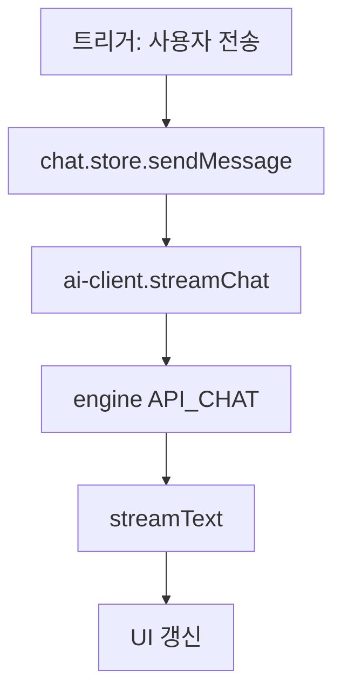

- 노드별 바로가기(항상 동작):
  - B: [채팅 전송 상세(MD)](feature-category-chat-experience.md#chat-send-stream)
  - C: [스트림 요청 상세(MD)](feature-category-chat-experience.md#chat-send-stream)
  - D: [엔진 API 처리 상세(MD)](feature-category-chat-experience.md#chat-engine-api)
  - E: [스트림 응답 처리 상세(MD)](feature-category-chat-experience.md#chat-stream-render)

- 코드 바로가기:
  - [chat.store.sendMessage 코드](../src/renderer/app/store/chat.store.ts)
  - [ai-client.streamChat 코드](../src/renderer/app/service/ai-client.service.ts)
  - [engine /api/chat 코드](../src/engine/server/routes/chat-generate.route.ts)

- 핵심 파일:
  - [src/renderer/app/component/structure/cmh-chat-shell/index.ts](../src/renderer/app/component/structure/cmh-chat-shell/index.ts)
  - [src/renderer/app/store/chat.store.ts](../src/renderer/app/store/chat.store.ts)
  - [src/renderer/app/service/ai-client.service.ts](../src/renderer/app/service/ai-client.service.ts)
  - [src/engine/server/routes/chat-generate.route.ts](../src/engine/server/routes/chat-generate.route.ts)

### 1.2 메시지 렌더링/툴 이벤트 카드
- 쉬운 설명: 답변 텍스트, 숨김 메시지, 툴 실행 카드가 화면에 그려집니다.
- 트리거: 스트림 delta 이벤트 수신
- 프로세스 체인: `parseAIStreamProtocol()` → `toolEvent`/`hidden` 판별 → `chat.store` 누적 → 메시지 컴포넌트 렌더

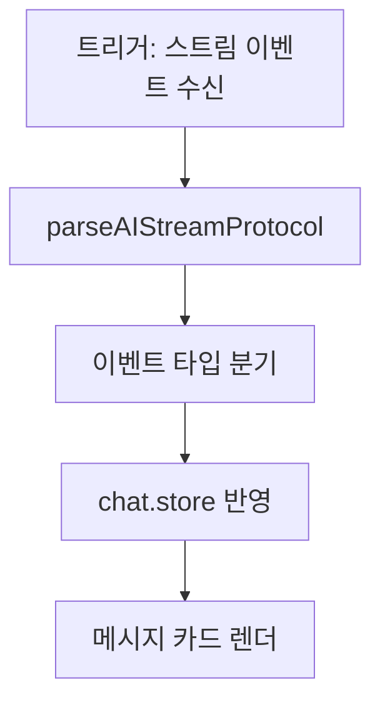

- 노드별 바로가기(항상 동작):
  - B: [스트림 파서 상세](feature-category-chat-experience.md#stream-parser)
  - C: [이벤트 분기 상세](feature-category-chat-experience.md#tool-event-timeline)
  - D: [chat.store 반영 코드](../src/renderer/app/store/chat.store.ts)
  - E: [메시지 카드 컴포넌트](../src/renderer/app/component/structure/cmh-chat-shell/sub/cmh-chat-message/index.ts)

- 세부 분기(글자로 크게 보기):
  - `text-delta` → `content` 누적 → 렌더
  - `reasoning-delta` → `thinking` 누적 → 렌더
  - `hidden/do-not-render` → `hidden=true` 처리 → 미노출
  - `tool-start/end/error` → `toolEvents` 누적 → 툴 카드 렌더

- 세부 항목 바로가기:
  - [Hidden Message Policy](feature-category-chat-experience.md#hidden-message-policy)
  - [Tool Event Timeline](feature-category-chat-experience.md#tool-event-timeline)

- 핵심 파일:
  - [src/shared/ai-stream/protocol-parser.ts](../src/shared/ai-stream/protocol-parser.ts)
  - [src/renderer/app/store/chat.store.ts](../src/renderer/app/store/chat.store.ts)
  - [src/renderer/app/component/structure/cmh-chat-shell/sub/cmh-chat-message/index.ts](../src/renderer/app/component/structure/cmh-chat-shell/sub/cmh-chat-message/index.ts)

### 1.3 모델/프로바이더 선택
- 쉬운 설명: 로컬 모델과 클라우드 모델을 합쳐서 사용자에게 보여주고 선택합니다.
- 트리거: 앱 시작, 모델 새로고침, 설정 변경
- 프로세스 체인: `loadLocalModelsFromDAL()` + `loadCloudModelsFromDAL()` → `mergeCloudModels()` → `applyModelSelection()`

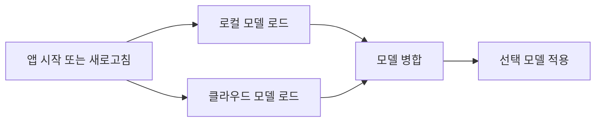

- 노드별 바로가기(항상 동작):
  - B: [로컬 모델 로드 상세](feature-category-chat-experience.md#local-model-load)
  - C: [클라우드 모델 로드 상세](feature-category-chat-experience.md#cloud-model-load)
  - E: [선택 모델 적용 상세](feature-category-chat-experience.md#model-selection-apply)

- 핵심 파일:
  - [src/renderer/app/store/chat.store.ts](../src/renderer/app/store/chat.store.ts)
  - [src/renderer/app/service/llm-model.service.ts](../src/renderer/app/service/llm-model.service.ts)
  - [src/engine/provider/model-factory.ts](../src/engine/provider/model-factory.ts)

### 1.4 프롬프트/토큰/컨텍스트 관리
- 쉬운 설명: 너무 긴 대화는 잘라서 모델 제한 안에서 안정적으로 보냅니다.
- 트리거: `/api/chat` 요청 생성 시
- 프로세스 체인: `resolveInferenceTarget()` → `countPromptTokens()` → `trimHistoryWithCounter()` → `maxOutputTokens` 계산

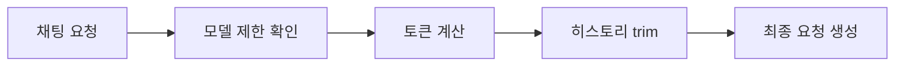

- 핵심 파일:
  - [src/engine/server/routes/chat-generate.route.ts](../src/engine/server/routes/chat-generate.route.ts)
  - [src/engine/service/token-counter.ts](../src/engine/service/token-counter.ts)

### 1.5 첨부파일 파싱 (텍스트/이미지/PDF)
- 쉬운 설명: 첨부를 모델이 읽을 수 있는 텍스트/데이터로 바꿉니다.
- 트리거: 파일 첨부 후 전송
- 프로세스 체인: `isImageAttachment()`/`isPdfAttachment()` → `toImageDataUrl()`/`buildAttachmentTextBlock()` → 메시지 본문 병합

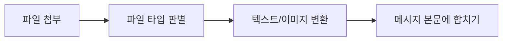

- 핵심 파일:
  - [src/renderer/app/service/attachment-parser.service.ts](../src/renderer/app/service/attachment-parser.service.ts)
  - [src/renderer/app/store/chat.store.ts](../src/renderer/app/store/chat.store.ts)

### 1.6 음성 기능 (STT/TTS)
- 쉬운 설명: 음성을 글로 바꾸고, 글을 음성으로 읽습니다.
- 트리거: 음성 입력 버튼/읽어주기 버튼
- 프로세스 체인(STT): `startRecording()` → `blobToFloat32Array()` → Whisper pipeline  
- 프로세스 체인(TTS): `speak()` → `speakEdgeTts()` 또는 `speakWebSpeech()`

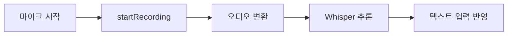

- 핵심 파일:
  - [src/renderer/app/service/stt.service.ts](../src/renderer/app/service/stt.service.ts)
  - [src/renderer/app/service/tts.service.ts](../src/renderer/app/service/tts.service.ts)
  - [src/renderer/module/cmh-settings/page/cmh-settings-detail/index.ts](../src/renderer/module/cmh-settings/page/cmh-settings-detail/index.ts)

### 1.7 워크플로우 편집기
- 쉬운 설명: 노드를 끌어다 놓고 연결해 작업 흐름을 만듭니다.
- 트리거: 워크플로우 상세 페이지 진입
- 프로세스 체인: `onDragStart()` → `onDrop()` → `addNode()` → `onConnect()` → `addEdge()`

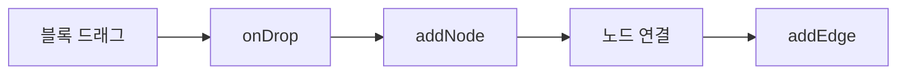

- 핵심 파일:
  - [src/renderer/module/cmh-workflow/page/cmh-workflow-detail/index.ts](../src/renderer/module/cmh-workflow/page/cmh-workflow-detail/index.ts)
  - [src/renderer/app/store/workflow.store.ts](../src/renderer/app/store/workflow.store.ts)

### 1.8 워크플로우 모니터링/스냅샷
- 쉬운 설명: 실행 중 노드 상태와 툴 호출 기록을 시간 순서로 봅니다.
- 트리거: 모니터링 패널 토글, 실행 이벤트 수신
- 프로세스 체인: `onMonitorNodeUpdate()`/`onMonitorToolCall()` → `executionSnapshots` 저장 → `selectSnapshot()`로 상태 재현

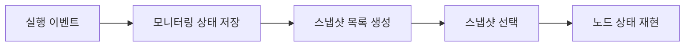

- 핵심 파일:
  - [src/renderer/module/cmh-workflow/page/cmh-workflow-detail/index.ts](../src/renderer/module/cmh-workflow/page/cmh-workflow-detail/index.ts)
  - [src/engine/langchain/monitoring/stream-event-monitor.ts](../src/engine/langchain/monitoring/stream-event-monitor.ts)

### 1.9 멀티에이전트 실행 엔진
- 쉬운 설명: 어떤 에이전트를 실행할지 자동으로 골라서 돌립니다.
- 트리거: `process()` 또는 `runAgent()` 호출
- 프로세스 체인: `selectBestAgentByRole()` → `runWithStats()` → `AgentHarness.run()`

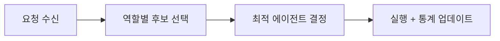

- 핵심 파일:
  - [src/engine/agent/orchestrator.ts](../src/engine/agent/orchestrator.ts)
  - [src/engine/agent/harness.ts](../src/engine/agent/harness.ts)
  - [src/engine/langchain/graph/builder.ts](../src/engine/langchain/graph/builder.ts)

### 1.10 대화 저장/불러오기/평가
- 쉬운 설명: 대화 목록, 메시지, 평점을 DB에 저장하고 다시 불러옵니다.
- 트리거: 새 대화 생성, 메시지 저장, 평점 클릭
- 프로세스 체인: `saveConversation()`/`persistMessage()`/`rateMessage()` → DAL Repository 저장

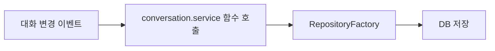

- 핵심 파일:
  - [src/renderer/app/service/conversation.service.ts](../src/renderer/app/service/conversation.service.ts)
  - [src/engine/data/repository-factory.ts](../src/engine/data/repository-factory.ts)
  - [src/engine/data/sqlite-adapter.ts](../src/engine/data/sqlite-adapter.ts)

### 1.11 운영 안정성 (캐시/큐/메트릭)
- 쉬운 설명: 느린 응답을 줄이고, 실패 작업을 따로 보관하고, 상태를 수치로 보여줍니다.
- 트리거: API 요청, 큐 실패, 메트릭 조회
- 프로세스 체인: `responseCache.getWithMeta()` → stale fallback  
  + `QueueEvents.failed` → DLQ 이동  
  + `metrics.export()`/`metrics.snapshot()`

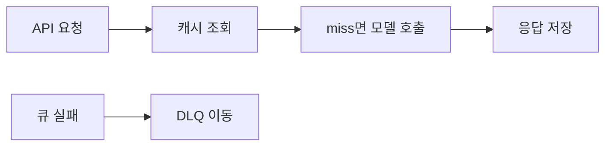

- 핵심 파일:
  - [src/engine/service/response-cache.service.ts](../src/engine/service/response-cache.service.ts)
  - [src/engine/queue/manager.ts](../src/engine/queue/manager.ts)
  - [src/engine/service/metrics.service.ts](../src/engine/service/metrics.service.ts)
  - [src/engine/server/routes.ts](../src/engine/server/routes.ts)

### 1.12 보안/네트워크 진입점
- 쉬운 설명: 과도 요청 차단, 웹훅 서명 검증, mDNS/Tailscale 추천 경로 계산
- 트리거: `/api/chat` 요청, webhook 요청, discovery 갱신
- 프로세스 체인: Rate Limit middleware → `createWebhookAuthMiddleware()` → `resolveBestDiscoveryRoute()`

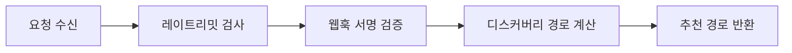

- 핵심 파일:
  - [src/engine/server/routes.ts](../src/engine/server/routes.ts)
  - [src/engine/server/middleware/webhook-auth.ts](../src/engine/server/middleware/webhook-auth.ts)
  - [src/engine/discovery/routing.ts](../src/engine/discovery/routing.ts)
  - [src/engine/agent/security-gate.ts](../src/engine/agent/security-gate.ts)

---

## 2. 문서 인덱스 (필수/심화)

### 2.1 필수 문서
- 전체 실행 흐름 + 장애 대응: [developer-handbook.md](developer-handbook.md)
- 기존 62개 기능 기준: [feature-catalog-62.md](feature-catalog-62.md)
- 신규 발굴 로그(작업 중 기록): [feature-discovery-worklog.md](feature-discovery-worklog.md)

### 2.2 카테고리 상세 문서
- Chat Experience: [feature-category-chat-experience.md](feature-category-chat-experience.md)
- AI Runtime: [feature-category-ai-runtime.md](feature-category-ai-runtime.md)
- Workflow/Admin: [feature-category-workflow-admin.md](feature-category-workflow-admin.md)
- Ops/Security: [feature-category-ops-security.md](feature-category-ops-security.md)
- Architecture/Support: [feature-category-architecture-support.md](feature-category-architecture-support.md)

### 2.3 심화 참고
- [feature-driven-developer-guide.md](feature-driven-developer-guide.md)
- [langchain-langgraph-catalog.md](langchain-langgraph-catalog.md)
- [librechat-integration-review.md](librechat-integration-review.md)

---

## 3. 3개월차 개발자용 빠른 시작 순서

1) [developer-handbook.md](developer-handbook.md)에서 전체 흐름을 먼저 읽습니다.  
2) 지금 수정할 기능 그룹(1.1 ~ 1.12) 하나를 고릅니다.  
3) 그 그룹의 “프로세스 체인”을 따라 함수 이름 순서대로 파일을 엽니다.  
4) 변경 후 [feature-discovery-worklog.md](feature-discovery-worklog.md)에 한 줄 기록합니다.

---

## 4. 유지보수 규칙 요약

- 기능 변경 시 [feature-catalog-62.md](feature-catalog-62.md) 또는 해당 카테고리 문서를 같이 업데이트합니다.
- 새로 찾은 기능은 먼저 [feature-discovery-worklog.md](feature-discovery-worklog.md)에 기록한 뒤 카테고리 문서로 옮깁니다.
- 테스트는 [tests](../tests) 루트만 사용합니다 (`src/renderer/tests/**` 재도입 금지).

---

## 5. VitePress 문서 포털 실행/배포

- 로컬 실행
  - `pnpm docs:dev`
- 프로덕션 빌드
  - `pnpm docs:build`
- 로컬 프리뷰
  - `pnpm docs:preview`
- 서브도메인 배포 가이드
  - [deployment-subdomain.md](deployment-subdomain.md)
