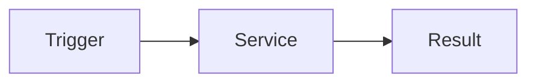

# Developer Documentation Style Guide (EN)

## 1) Purpose (Overview)

This guide defines a unified style for writing developer docs in the CMH portal so that **junior developers can follow them step by step**.

It combines:

- structured documentation sections (Overview, Prerequisites, Configuration, Example, Events)
- practical execution sections (Function, Trigger, Diagram, Step-by-step, Checklist)

## 2) Style references analyzed

- extension overview guides
- concept-first base guides
- event/webhook-focused guides
- component property/event table guides

## 3) Required document structure

## Overview

- Problem statement in 2–4 lines
- Target reader level

## Prerequisites

- Required knowledge
- Required environment/version

## At a glance

| Item | Content |
|---|---|
| Function | What it does |
| Trigger | When it runs |
| Input | What comes in |
| Output | What is produced |
| Key files | Related file paths |

## Trigger & Flow

- Trigger explanation
- At least one Mermaid diagram



## Example

- Minimal runnable snippet
- Prefer short copy-paste examples

## Events / Properties / API

| Event/Property | Description |
|---|---|
| `onSomething` | Event description |

## Step-by-step

1. Prepare
2. Configure
3. Execute
4. Verify

## Troubleshooting

- At least 3 common issues
- Write cause/fix pairs

## Checklist

- [ ] No dead links
- [ ] Example code is runnable
- [ ] No secrets/private data
- [ ] Terms explained for juniors

## Related Docs

- Related links

## 4) Writing rules

1. Keep sentences short and direct
2. Prefer actionable steps over abstract theory
3. Always include table/diagram/example
4. Use real existing file paths only
5. Never expose secrets/private URLs in public docs

## 5) CMH-specific section rules

When relevant, add these sections:

- **Function**
- **Trigger**
- **Diagram**
- **Ops Notes**

## 6) Starter template

```markdown
# Title

## Overview

## Prerequisites

## At a glance

| Item | Content |
|---|---|
| Function | |
| Trigger | |
| Input | |
| Output | |
| Key files | |

## Trigger & Flow


## Example

## Events / Properties / API

| Event/Property | Description |
|---|---|

## Step-by-step

1.
2.
3.

## Troubleshooting

## Checklist

- [ ]

## Related Docs
```
