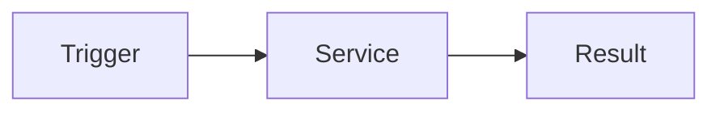

# 개발자 문서 작성 스타일 가이드 (KO)

## 1) 목적 (Overview)

이 문서는 CMH 문서 포털에서 **초급 개발자도 바로 따라할 수 있는** 개발자 문서를 작성하기 위한 표준입니다.

이 가이드는 아래 스타일을 결합합니다.

- 구조적 설명(Overview, Prerequisites, Configuration, Example, Events)
- 실무형 설명(기능, 트리거, 다이어그램, 단계별 절차, 체크리스트)

## 2) 참고한 문서 스타일

- 확장 개요형 가이드
- 기초 개념형 가이드
- 이벤트/웹훅 중심 가이드
- 컴포넌트 속성/이벤트 표 중심 가이드

## 3) 문서 기본 형식 (필수)

## Overview

- 이 문서가 해결하는 문제 2~4줄
- 대상 독자(초급/중급/운영자)

## Prerequisites

- 필요한 사전 지식
- 필요한 환경/버전

## At a glance (요약 표)

| 항목 | 내용 |
|---|---|
| 기능 | 무엇을 하는가 |
| 트리거 | 언제 실행되는가 |
| 입력 | 어떤 데이터가 들어오는가 |
| 출력 | 무엇이 생성/반환되는가 |
| 핵심 파일 | 관련 파일 경로 |

## Trigger & Flow

- 트리거 설명
- Mermaid 다이어그램 1개 이상



## Example

- 최소 실행 예시(코드/설정)
- 복붙 가능한 짧은 예시 우선

## Events / Properties / API

- 이벤트 표 또는 속성 표 제공

| Event/Property | 설명 |
|---|---|
| `onSomething` | 이벤트 설명 |

## Step-by-step

1. 준비
2. 설정
3. 실행
4. 검증

## Troubleshooting

- 자주 발생하는 오류 3개 이상
- 원인/해결 방법 쌍으로 작성

## Checklist

- [ ] 링크 깨짐 없음
- [ ] 예시 코드 실행 가능
- [ ] 민감정보 없음
- [ ] 초급자 기준 용어 설명 포함

## Related Docs

- 관련 문서 링크

## 4) 작성 규칙

1. 한 문장 한 의미로 짧게 작성
2. 추상 설명보다 실행 절차 우선
3. 표/다이어그램/예시를 반드시 포함
4. 파일 경로는 실제 존재 경로만 사용
5. Public 문서에 내부 정보(토큰/계정/비공개 URL) 금지

## 5) CMH 전용 섹션 추가 규칙

CMH 문서는 아래 섹션을 가능한 경우 추가합니다.

- **기능(Function)**: 무엇을 해결하는가
- **트리거(Trigger)**: 언제 실행되는가
- **다이어그램(Diagram)**: 흐름 시각화
- **운영 포인트(Ops Notes)**: 배포/모니터링/복구

## 6) 템플릿 (복사해서 시작)

```markdown
# 문서 제목

## Overview

## Prerequisites

## At a glance

| 항목 | 내용 |
|---|---|
| 기능 | |
| 트리거 | |
| 입력 | |
| 출력 | |
| 핵심 파일 | |

## Trigger & Flow


## Example

## Events / Properties / API

| Event/Property | 설명 |
|---|---|

## Step-by-step

1.
2.
3.

## Troubleshooting

## Checklist

- [ ]

## Related Docs
```
